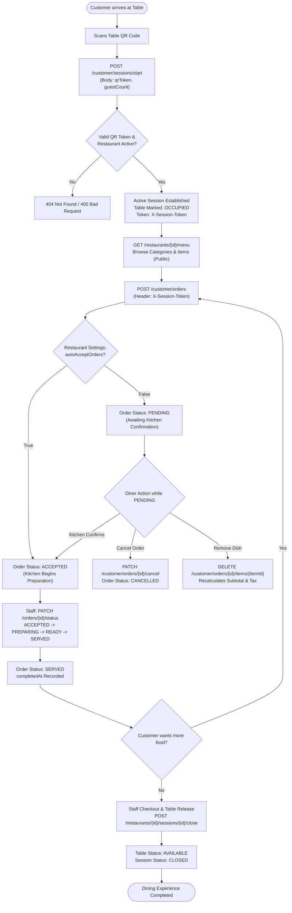
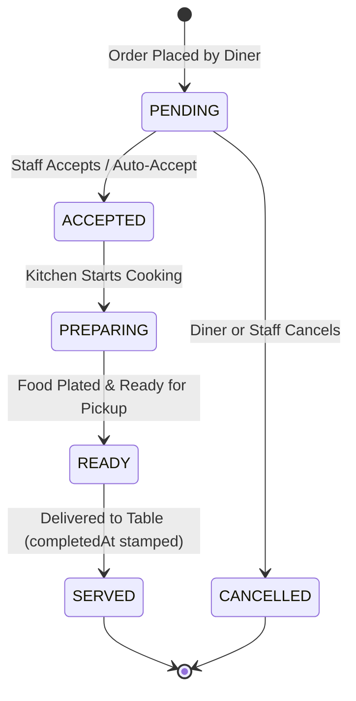

# Plato Restaurant Platform — API Specification & Architecture Guide

> **Document Version**: 1.0.0  
> **Target Audience**: Technical Reviewers, System Integrators, Frontend Engineers  
> **Status**: Production Ready  
> **Base URL**: `https://api.plato.dining.com/api/v1` (Production) / `http://localhost:8080/api/v1` (Local)

---

## 1. Executive Summary & Architecture Overview

Plato is an enterprise-grade digital dining and restaurant management platform. It enables frictionless, contactless dining where guests scan a table QR code to browse menus, customize dishes, and place orders directly from their mobile browser without downloading an app or creating a user account. 

Concurrently, restaurant owners, managers, chefs, and waitstaff use a role-based portal to manage restaurants, configure menus, control real-time dish availability, track table occupancy, and process kitchen orders in a First-In, First-Out (FIFO) queue.

---

## 2. System Flowcharts & State Machines

### 2.1 Customer End-to-End Dining Flowchart



---

### 2.2 Kitchen Order State Machine



---

## 3. Communication Standards & Response Protocols

All API responses are wrapped in a standard uniform envelope.

### 3.1 Standard Success Envelope (`200 OK`, `201 CREATED`)
```json
{
  "success": true,
  "message": "Human-readable confirmation message",
  "data": { ... },
  "timestamp": "2026-09-09T16:00:00.123456"
}
```

### 3.2 Standard Error Envelope (`4xx`, `5xx`)
```json
{
  "success": false,
  "message": "Human-readable error explanation",
  "data": null,
  "timestamp": "2026-09-09T16:00:00.123456"
}
```

### 3.3 Field-Level Validation Error Envelope (`400 Bad Request`)
When input validation fails (e.g. missing mandatory fields, negative quantities), `data` contains an array of specific field violation messages:
```json
{
  "success": false,
  "message": "Validation failed",
  "data": [
    "Quantity must be at least 1",
    "QR token is required",
    "Price must be greater than 0"
  ],
  "timestamp": "2026-09-09T16:00:00.123456"
}
```

### 3.4 HTTP Status Codes Cheat Sheet

| HTTP Code | Label | Usage in Plato |
|---|---|---|
| `200` | `OK` | Successful retrieval, update, or cancellation |
| `201` | `Created` | Successful creation of an order, session, user, table, or restaurant |
| `400` | `Bad Request` | Validation failures, attempting to cancel an order already being cooked, inactive restaurant |
| `401` | `Unauthorized` | Missing/invalid JWT token or expired customer dining session |
| `403` | `Forbidden` | Access denied due to role mismatch or cross-restaurant tenant violation |
| `404` | `Not Found` | Entity not found with the specified ID, invalid table QR token |
| `409` | `Conflict` | Unique constraint violation (e.g., duplicate email, duplicate table number) |
| `500` | `Internal Server Error` | Unhandled internal runtime exception |

---

## 4. Authentication & Security Schemes

Plato enforces zero-trust tenant isolation with two distinct authorization models:

1. **Staff & Administration**: `Authorization: Bearer <JWT>`
   - Signed using HMAC-SHA384 (HS384) with 24-hour validity.
   - Enforces role-based access control across:
     - `SUPER_ADMIN`: Full multi-tenant governance.
     - `OWNER`: Full management of restaurants owned by the user.
     - `EMPLOYEE`: Restaurant-scoped operations based on job role (`MANAGER`, `CHEF`, `WAITER`, `CASHIER`).
2. **Customer Dining Sessions**: `X-Session-Token: <64-character-hex>`
   - Opaque, cryptographically secure 256-bit random hex token.
   - Enforces an automated **sliding inactivity window of 30 minutes** that auto-renews on every dining action.
3. **Public Access**:
   - `POST /auth/login` (Staff login)
   - `POST /customer/sessions/start` (QR table entry)
   - `GET /restaurants/{id}/menu` (Public restaurant catalog)
   - `/actuator/health` (Infrastructure health probe)

---

## 5. Exhaustive API Reference

---

### Module 1: Authentication

#### 1.1 Staff & Owner Login
- **Endpoint**: `POST /api/v1/auth/login`
- **Access**: Public
- **Description**: Verifies credentials and issues a signed JWT token.
- **Request Body**:
  ```json
  {
    "email": "owner@spicegarden.com",
    "password": "Password@123"
  }
  ```
- **Success Result (`200 OK`)**:
  ```json
  {
    "success": true,
    "message": "Login successful",
    "data": {
      "accessToken": "eyJhbGciOiJIUzM4NCJ9.eyJzdWIiOiIxMmUzNG...",
      "tokenType": "Bearer",
      "role": "OWNER",
      "fullName": "Alice Johnson"
    },
    "timestamp": "2026-09-09T16:00:00"
  }
  ```
- **Failure Results**:
  - `400 Bad Request`: Email or password field blank.
  - `401 Unauthorized`: `"Authentication required"` (Incorrect password or non-existent user).

---

### Module 2: User & Identity Management

#### 2.1 Create Platform User
- **Endpoint**: `POST /api/v1/users`
- **Access**: `SUPER_ADMIN`
- **Request Body**:
  ```json
  {
    "email": "chef.roberto@gmail.com",
    "password": "SecurePassword@123",
    "fullName": "Roberto Rossi",
    "phone": "9876543210",
    "role": "EMPLOYEE"
  }
  ```
- **Success Result (`201 Created`)**:
  ```json
  {
    "success": true,
    "message": "User created successfully",
    "data": {
      "id": "e4b5c6d7-1111-2222-3333-444455556666",
      "email": "chef.roberto@gmail.com",
      "fullName": "Roberto Rossi",
      "phone": "9876543210",
      "role": "EMPLOYEE",
      "status": "ACTIVE",
      "createdAt": "2026-09-09T16:00:00"
    },
    "timestamp": "2026-09-09T16:00:00"
  }
  ```
- **Failure Results**:
  - `400 Bad Request`: Invalid email format or password less than 8 characters.
  - `403 Forbidden`: Caller lacks `SUPER_ADMIN` authority.
  - `409 Conflict`: `"Email is already registered"`.

#### 2.2 List Users (Paginated)
- **Endpoint**: `GET /api/v1/users`
- **Access**: `SUPER_ADMIN`
- **Query Parameters**: `?page=0&size=20&sort=createdAt,desc`
- **Success Result (`200 OK`)**:
  ```json
  {
    "success": true,
    "message": "Users fetched successfully",
    "data": {
      "content": [
        {
          "id": "e4b5c6d7-...",
          "email": "owner@spicegarden.com",
          "fullName": "Alice Johnson",
          "role": "OWNER",
          "status": "ACTIVE"
        }
      ],
      "totalElements": 1,
      "totalPages": 1,
      "size": 20,
      "number": 0
    },
    "timestamp": "2026-09-09T16:00:00"
  }
  ```

#### 2.3 Get User by ID
- **Endpoint**: `GET /api/v1/users/{id}`
- **Access**: `SUPER_ADMIN` or Self
- **Success Result (`200 OK`)**: User details object.
- **Failure Results**:
  - `403 Forbidden`: Non-admin user querying another user's profile.
  - `404 Not Found`: `"User not found with id: ..."`.

#### 2.4 Update User Profile
- **Endpoint**: `PUT /api/v1/users/{id}`
- **Access**: `SUPER_ADMIN` or Self
- **Request Body**: `{"fullName": "Roberto M. Rossi", "phone": "9876500000"}`
- **Success Result (`200 OK`)**: Updated user profile.
- **Failure Results**: `403 Forbidden`, `404 Not Found`.

#### 2.5 Update User Status
- **Endpoint**: `PATCH /api/v1/users/{id}/status`
- **Access**: `SUPER_ADMIN`
- **Request Body**: `{"status": "SUSPENDED"}` (`ACTIVE`, `SUSPENDED`, `DELETED`)
- **Success Result (`200 OK`)**: Updated user profile.

#### 2.6 Delete User (Soft Delete)
- **Endpoint**: `DELETE /api/v1/users/{id}`
- **Access**: `SUPER_ADMIN`
- **Success Result (`200 OK`)**: `"User deleted successfully"`.

---

### Module 3: Restaurant Management & Operational Settings

#### 3.1 Register Restaurant
- **Endpoint**: `POST /api/v1/restaurants`
- **Access**: `OWNER`, `SUPER_ADMIN`
- **Request Body**:
  ```json
  {
    "name": "The Tuscan Table",
    "description": "Authentic Italian wood-fired cuisine",
    "phone": "9876543210",
    "email": "contact@tuscantable.com",
    "address": "12 Residency Road",
    "city": "Bengaluru",
    "state": "Karnataka",
    "country": "India",
    "zipcode": "560025",
    "timezone": "Asia/Kolkata",
    "openingTime": "11:00",
    "closingTime": "23:00"
  }
  ```
- **Success Result (`201 Created`)**:
  ```json
  {
    "success": true,
    "message": "Restaurant created successfully",
    "data": {
      "id": "e3b0c442-98fc-1c14-9afb-4c8996fb9242",
      "ownerId": "uuid-of-owner",
      "name": "The Tuscan Table",
      "status": "ACTIVE",
      "taxPercentage": 5.00,
      "serviceCharge": 0.00,
      "acceptingOrders": true,
      "autoAcceptOrders": false
    },
    "timestamp": "2026-09-09T16:00:00"
  }
  ```

#### 3.2 List Restaurants
- **Endpoint**: `GET /api/v1/restaurants`
- **Access**: `OWNER` (returns owned restaurants), `SUPER_ADMIN` (returns all)
- **Success Result (`200 OK`)**: Array of restaurant profile objects.

#### 3.3 Get Restaurant Details
- **Endpoint**: `GET /api/v1/restaurants/{id}`
- **Access**: Authenticated / Public
- **Success Result (`200 OK`)**: Full restaurant object with operational timings and settings.
- **Failure Results**: `404 Not Found`.

#### 3.4 Update Restaurant Profile
- **Endpoint**: `PUT /api/v1/restaurants/{id}`
- **Access**: `OWNER` (of this restaurant), `SUPER_ADMIN`
- **Success Result (`200 OK`)**: Updated restaurant profile.
- **Failure Results**: `403 Forbidden` if caller does not own this venue.

#### 3.5 Update Operational Settings
- **Endpoint**: `PATCH /api/v1/restaurants/{id}/settings`
- **Access**: `OWNER`, `SUPER_ADMIN`
- **Description**: Configure billing tax, service charge, auto-acceptance, and payment toggles.
- **Request Body**:
  ```json
  {
    "taxPercentage": 5.00,
    "serviceCharge": 2.50,
    "allowCashPayment": true,
    "allowCardPayment": true,
    "allowUpi": true,
    "allowOnlinePayment": false,
    "acceptingOrders": true,
    "autoAcceptOrders": false
  }
  ```
- **Success Result (`200 OK`)**: Updated restaurant profile.

#### 3.6 Update Restaurant Status
- **Endpoint**: `PATCH /api/v1/restaurants/{id}/status`
- **Access**: `SUPER_ADMIN`
- **Request Body**: `{"status": "SUSPENDED"}` (`ACTIVE`, `INACTIVE`, `SUSPENDED`)
- **Success Result (`200 OK`)**: Updated restaurant profile.

---

### Module 4: Table & QR Code Management

#### 4.1 Create Table
- **Endpoint**: `POST /api/v1/restaurants/{restaurantId}/tables`
- **Access**: `OWNER`
- **Description**: Creates a dining table and automatically provisions an unguessable, secure `qrToken`.
- **Request Body**:
  ```json
  {
    "tableNumber": "T-12",
    "capacity": 4,
    "label": "Window Seat"
  }
  ```
- **Success Result (`201 Created`)**:
  ```json
  {
    "success": true,
    "message": "Table created successfully",
    "data": {
      "id": "c9a0d8e7-5b6a-4f3e-bc21-0987654321fe",
      "restaurantId": "e3b0c442-98fc-1c14-9afb-4c8996fb9242",
      "tableNumber": "T-12",
      "capacity": 4,
      "label": "Window Seat",
      "status": "AVAILABLE",
      "qrToken": "550e8400-e29b-41d4-a716-446655440000",
      "qrCodeUrl": "https://plato.dining.com/qr/550e8400-e29b-41d4-a716-446655440000"
    },
    "timestamp": "2026-09-09T16:00:00"
  }
  ```
- **Failure Results**:
  - `400 Bad Request`: Capacity < 1 or missing table number.
  - `403 Forbidden`: Caller does not own this restaurant.
  - `409 Conflict`: `"Table number 'T-12' already exists in this restaurant"`.

#### 4.2 List Tables for Restaurant
- **Endpoint**: `GET /api/v1/restaurants/{restaurantId}/tables`
- **Access**: `OWNER`, `SUPER_ADMIN`
- **Success Result (`200 OK`)**: List of tables with current status (`AVAILABLE` vs `OCCUPIED`).

#### 4.3 Regenerate Table QR Token
- **Endpoint**: `POST /api/v1/restaurants/{restaurantId}/tables/{tableId}/qr/regenerate`
- **Access**: `OWNER`
- **Description**: Replaces compromised QR stickers. Invalidates the old QR token without breaking existing database foreign keys.
- **Success Result (`200 OK`)**: Updated table object containing new `qrToken` and `qrCodeUrl`.

#### 4.4 Update / Delete Table
- **Endpoints**: `PUT /api/v1/restaurants/{restaurantId}/tables/{tableId}`, `DELETE /api/v1/restaurants/{restaurantId}/tables/{tableId}`
- **Access**: `OWNER`
- **Success Result (`200 OK`)**: Confirmation of update or deletion.

---

### Module 5: Employee Management

#### 5.1 Assign Staff Member to Restaurant
- **Endpoint**: `POST /api/v1/restaurants/{restaurantId}/employees`
- **Access**: `OWNER`
- **Request Body**:
  ```json
  {
    "userId": "e4b5c6d7-1111-2222-3333-444455556666",
    "role": "CHEF"
  }
  ```
  *Allowed Job Roles*: `MANAGER`, `CHEF`, `WAITER`, `CASHIER`.
- **Success Result (`201 Created`)**:
  ```json
  {
    "success": true,
    "message": "Employee assigned successfully",
    "data": {
      "id": "employee-uuid",
      "restaurantId": "e3b0c442-...",
      "userId": "e4b5c6d7-...",
      "role": "CHEF",
      "isActive": true
    },
    "timestamp": "2026-09-09T16:00:00"
  }
  ```
- **Failure Results**:
  - `400 Bad Request`: User does not hold the platform `EMPLOYEE` role.
  - `409 Conflict`: `"User is already assigned to this restaurant"`.

#### 5.2 List Active Staff
- **Endpoint**: `GET /api/v1/restaurants/{restaurantId}/employees`
- **Access**: `OWNER`, `SUPER_ADMIN`
- **Success Result (`200 OK`)**: Array of active employee records.

#### 5.3 Modify Employee Job Role / Deactivate
- **Endpoints**: 
  - `PATCH /api/v1/restaurants/{restaurantId}/employees/{employeeId}/role` (Body: `{"role": "MANAGER"}`)
  - `DELETE /api/v1/restaurants/{restaurantId}/employees/{employeeId}` (Soft deactivates: `isActive = false`)
- **Access**: `OWNER`

---

### Module 6: Menu Management & Public Catalog

#### 6.1 Create Menu Category
- **Endpoint**: `POST /api/v1/restaurants/{restaurantId}/menu/categories`
- **Access**: `OWNER`
- **Request Body**:
  ```json
  {
    "name": "Wood-fired Pizzas",
    "description": "Authentic sourdough 12-inch Neapolitan pizzas",
    "displayOrder": 2
  }
  ```
- **Success Result (`201 Created`)**: Category object.
- **Failure Results**: `409 Conflict` if category name already exists in this restaurant.

#### 6.2 View Public Restaurant Menu Catalog
- **Endpoint**: `GET /api/v1/restaurants/{restaurantId}/menu`
- **Access**: Public (No auth required)
- **Description**: Customer-facing menu catalog grouping active dishes under active categories.
- **Success Result (`200 OK`)**:
  ```json
  {
    "success": true,
    "message": "Menu catalog retrieved",
    "data": [
      {
        "id": "cat-uuid-1",
        "name": "Wood-fired Pizzas",
        "displayOrder": 2,
        "items": [
          {
            "id": "dish-uuid-101",
            "name": "Margherita D.O.P.",
            "description": "San Marzano tomatoes, buffalo mozzarella, fresh basil",
            "price": 450.00,
            "imageUrl": "https://images.plato.com/margherita.jpg",
            "isVeg": true,
            "isAvailable": true
          }
        ]
      }
    ],
    "timestamp": "2026-09-09T16:00:00"
  }
  ```

#### 6.3 Add Dish to Menu
- **Endpoint**: `POST /api/v1/restaurants/{restaurantId}/menu/items`
- **Access**: `OWNER`
- **Request Body**:
  ```json
  {
    "categoryId": "cat-uuid-1",
    "name": "Truffle Tagliolini",
    "description": "Handmade egg pasta with black winter truffle butter",
    "price": 620.00,
    "imageUrl": "https://images.plato.com/tagliolini.jpg",
    "isVeg": true,
    "isAvailable": true
  }
  ```
- **Success Result (`201 Created`)**: Dish entity object.

#### 6.4 Update Dish / Toggle Stock Availability
- **Endpoints**:
  - `PUT /api/v1/restaurants/{restaurantId}/menu/items/{itemId}` (Update name, price, description)
  - `PATCH /api/v1/restaurants/{restaurantId}/menu/items/{itemId}/availability` (Body: `{"isAvailable": false}`)
- **Access**: `OWNER`
- **Success Result (`200 OK`)**: Updated dish object.

---

### Module 7: Customer Dining Sessions

#### 7.1 Start or Rejoin Dining Session (QR Scan)
- **Endpoint**: `POST /api/v1/customer/sessions/start`
- **Access**: Public (Validated via `qrToken`)
- **Description**: Scanning a table QR code begins a dining session. Marks table `OCCUPIED`. If another diner at the same table scans the QR, they seamlessly join the existing session.
- **Request Body**:
  ```json
  {
    "qrToken": "550e8400-e29b-41d4-a716-446655440000",
    "guestCount": 2
  }
  ```
- **Success Result (`201 Created`)**:
  ```json
  {
    "success": true,
    "message": "Dining session started",
    "data": {
      "id": "session-uuid-999",
      "restaurantId": "e3b0c442-...",
      "restaurantName": "The Tuscan Table",
      "tableId": "c9a0d8e7-...",
      "tableNumber": "T-12",
      "sessionToken": "a3f8c2b984d7e10f4433221100aabbccddeeff00112233445566778899aabbcc",
      "status": "ACTIVE",
      "guestCount": 2,
      "startedAt": "2026-09-09T16:00:00",
      "expiresAt": "2026-09-09T16:30:00"
    },
    "timestamp": "2026-09-09T16:00:00"
  }
  ```
- **Failure Results**:
  - `400 Bad Request`: `"This restaurant is not currently active"` or `"This restaurant is currently not accepting orders"`.
  - `404 Not Found`: `"Table QR code is invalid"`.

#### 7.2 Get Current Session Status & Heartbeat
- **Endpoint**: `GET /api/v1/customer/sessions/current`
- **Access**: `X-Session-Token: <sessionToken>`
- **Description**: Checks session state. Automatically slides the expiration window forward by 30 minutes.
- **Success Result (`200 OK`)**: Session metadata object with renewed `expiresAt`.
- **Failure Results**:
  - `401 Unauthorized`: `"Your session has expired. Please scan the QR code again."`

#### 7.3 Staff Checkout & Table Release
- **Endpoint**: `POST /api/v1/restaurants/{restaurantId}/sessions/{sessionId}/close`
- **Access**: `OWNER`, `EMPLOYEE`, `SUPER_ADMIN`
- **Description**: Staff terminates the dining session after payment. Automatically releases the table to `AVAILABLE`.
- **Success Result (`200 OK`)**:
  ```json
  {
    "success": true,
    "message": "Session closed and table released",
    "data": null,
    "timestamp": "2026-09-09T17:15:00"
  }
  ```
- **Failure Results**: `403 Forbidden` if staff member does not belong to this venue.

---

### Module 8: Customer Order Placement

#### 8.1 Place Order from Table
- **Endpoint**: `POST /api/v1/customer/orders`
- **Access**: `X-Session-Token: <sessionToken>`
- **Description**: Places an order directly from the session. Freezes unit prices, computes subtotal and restaurant tax, and sets status to `PENDING` (or `ACCEPTED` if auto-accept is enabled).
- **Request Body**:
  ```json
  {
    "items": [
      {
        "menuItemId": "dish-uuid-101",
        "quantity": 2,
        "specialRequest": "Crispy crust please"
      }
    ],
    "notes": "Please serve with chili oil on the side"
  }
  ```
- **Success Result (`201 Created`)**:
  ```json
  {
    "success": true,
    "message": "Order placed successfully",
    "data": {
      "id": "order-uuid-501",
      "restaurantId": "e3b0c442-...",
      "tableId": "c9a0d8e7-...",
      "tableNumber": "T-12",
      "sessionId": "session-uuid-999",
      "orderNumber": "ORD-20260909-6421",
      "status": "PENDING",
      "subtotal": 900.00,
      "tax": 45.00,
      "discount": 0.00,
      "grandTotal": 945.00,
      "notes": "Please serve with chili oil on the side",
      "placedAt": "2026-09-09T16:15:00",
      "completedAt": null,
      "items": [
        {
          "id": "item-line-uuid-1",
          "menuItemId": "dish-uuid-101",
          "menuItemName": "Margherita D.O.P.",
          "quantity": 2,
          "unitPrice": 450.00,
          "subtotal": 900.00,
          "specialRequest": "Crispy crust please",
          "status": "PENDING"
        }
      ]
    },
    "timestamp": "2026-09-09T16:15:00"
  }
  ```
- **Failure Results**:
  - `400 Bad Request`: Empty items list, item marked out of stock, or restaurant not accepting orders.
  - `401 Unauthorized`: Session token missing or expired.
  - `404 Not Found`: Menu item ID does not exist.

#### 8.2 Get All Orders for Current Session
- **Endpoint**: `GET /api/v1/customer/orders`
- **Access**: `X-Session-Token: <sessionToken>`
- **Description**: Returns all orders placed during the table visit (e.g. appetizers + main courses).
- **Success Result (`200 OK`)**: Array of `OrderResponse` objects.

#### 8.3 Get Single Order by ID
- **Endpoint**: `GET /api/v1/customer/orders/{orderId}`
- **Access**: `X-Session-Token: <sessionToken>`
- **Success Result (`200 OK`)**: Single `OrderResponse` object.
- **Failure Results**: `404 Not Found` if order does not belong to this dining session.

#### 8.4 Cancel Pending Order
- **Endpoint**: `PATCH /api/v1/customer/orders/{orderId}/cancel`
- **Access**: `X-Session-Token: <sessionToken>`
- **Description**: Diners can cancel an order only while it is in `PENDING` status.
- **Success Result (`200 OK`)**: Order object with `status: "CANCELLED"`.
- **Failure Results**:
  - `400 Bad Request`: `"Order cannot be cancelled because it is already ACCEPTED"`.

#### 8.5 Remove Dish from Pending Order
- **Endpoint**: `DELETE /api/v1/customer/orders/{orderId}/items/{itemId}`
- **Access**: `X-Session-Token: <sessionToken>`
- **Description**: Removes an item from an order while `PENDING` and recalculates financial totals. If all items are removed, the order automatically transitions to `CANCELLED`.
- **Success Result (`200 OK`)**: Updated `OrderResponse`.
- **Failure Results**:
  - `400 Bad Request`: `"Items can only be removed while the order is pending confirmation"`.
  - `404 Not Found`: Line item not found.

---

### Module 9: Kitchen & Staff Order Management

#### 9.1 Kitchen Live Order Display Screen
- **Endpoint**: `GET /api/v1/restaurants/{restaurantId}/orders`
- **Access**: `OWNER`, `EMPLOYEE`, `SUPER_ADMIN`
- **Query Parameters**: `?status=PENDING` (Optional filter: `PENDING`, `ACCEPTED`, `PREPARING`, `READY`, `SERVED`)
- **Description**: Displays incoming food orders sorted FIFO (`placedAt ASC`) so kitchen staff prepare dishes in chronological sequence.
- **Success Result (`200 OK`)**:
  ```json
  {
    "success": true,
    "message": "Orders retrieved successfully",
    "data": [
      {
        "id": "order-uuid-501",
        "orderNumber": "ORD-20260909-6421",
        "tableNumber": "T-12",
        "status": "PENDING",
        "notes": "Please serve with chili oil on the side",
        "placedAt": "2026-09-09T16:15:00",
        "items": [
          {
            "menuItemName": "Margherita D.O.P.",
            "quantity": 2,
            "specialRequest": "Crispy crust please",
            "status": "PENDING"
          }
        ]
      }
    ],
    "timestamp": "2026-09-09T16:16:00"
  }
  ```
- **Failure Results**: `403 Forbidden` if staff member is not assigned to this restaurant.

#### 9.2 Update Order Preparation Status
- **Endpoint**: `PATCH /api/v1/orders/{orderId}/status`
- **Access**: `OWNER`, `EMPLOYEE`, `SUPER_ADMIN`
- **Description**: Advances food through the kitchen pipeline. Setting status to `SERVED` automatically sets `completedAt = now()`.
- **Request Body**:
  ```json
  {
    "status": "PREPARING"
  }
  ```
  *Allowed status values*: `PENDING`, `ACCEPTED`, `PREPARING`, `READY`, `SERVED`, `CANCELLED`.
- **Success Result (`200 OK`)**:
  ```json
  {
    "success": true,
    "message": "Order status updated successfully",
    "data": {
      "id": "order-uuid-501",
      "orderNumber": "ORD-20260909-6421",
      "status": "PREPARING",
      "completedAt": null
    },
    "timestamp": "2026-09-09T16:18:00"
  }
  ```
- **Failure Results**:
  - `400 Bad Request`: `"Cannot update status of a cancelled order"` or `"Cannot modify an order that has already been served"`.
  - `403 Forbidden`: Caller not authorized for this restaurant.
  - `404 Not Found`: Order ID does not exist.

---

### Module 10: Billing & Payments

#### 10.1 Customer View Dynamic Bill Summary
- **Endpoint**: `GET /api/v1/customer/billing/summary`
- **Access**: `X-Session-Token: <sessionToken>`
- **Description**: Dynamically aggregates all non-cancelled orders for this dining visit. Computes orders subtotal, tax breakdown, restaurant service charge, discounts, and grand total.
- **Success Result (`200 OK`)**:
  ```json
  {
    "success": true,
    "message": "Bill summary retrieved",
    "data": {
      "sessionId": "session-uuid-999",
      "restaurantId": "e3b0c442-...",
      "restaurantName": "The Tuscan Table",
      "tableId": "c9a0d8e7-...",
      "tableNumber": "T-12",
      "orders": [ ... ],
      "ordersSubtotal": 900.00,
      "taxTotal": 45.00,
      "serviceChargePercentage": 2.50,
      "serviceChargeAmount": 22.50,
      "discount": 0.00,
      "grandTotal": 967.50,
      "hasPendingOrders": false
    },
    "timestamp": "2026-09-09T16:30:00"
  }
  ```
- **Failure Results**:
  - `401 Unauthorized`: Session expired or invalid token.

#### 10.2 Customer Request Bill
- **Endpoint**: `POST /api/v1/customer/billing/request-bill`
- **Access**: `X-Session-Token: <sessionToken>`
- **Description**: Signals cashier that diners are ready to pay. Validates payment method against restaurant settings (`allowCashPayment`, `allowCardPayment`, `allowUpi`, `allowOnlinePayment`).
- **Request Body**:
  ```json
  {
    "paymentMethod": "UPI",
    "notes": "Please bring UPI scanner to Table 12"
  }
  ```
  *Allowed methods*: `CASH`, `CARD`, `UPI`, `ONLINE`.
- **Success Result (`200 OK`)**:
  ```json
  {
    "success": true,
    "message": "Bill requested successfully",
    "data": {
      "id": "pay-uuid-101",
      "sessionId": "session-uuid-999",
      "restaurantId": "e3b0c442-...",
      "tableNumber": "T-12",
      "subtotal": 900.00,
      "tax": 45.00,
      "serviceCharge": 22.50,
      "discount": 0.00,
      "amount": 967.50,
      "paymentMethod": "UPI",
      "status": "PENDING",
      "transactionReference": null,
      "paidAt": null,
      "createdAt": "2026-09-09T16:30:00"
    },
    "timestamp": "2026-09-09T16:30:00"
  }
  ```
- **Failure Results**:
  - `400 Bad Request`: `"This restaurant does not accept UPI payments"` or `"Cannot request bill for a session with no active orders"`.
  - `401 Unauthorized`: Invalid session token.

#### 10.3 Customer Check Payment Status
- **Endpoint**: `GET /api/v1/customer/billing/payment`
- **Access**: `X-Session-Token: <sessionToken>`
- **Description**: Checks current payment status (`PENDING` vs `COMPLETED`).
- **Success Result (`200 OK`)**: Returns `PaymentResponse`.
- **Failure Results**: `404 Not Found` if bill has not been requested yet.

#### 10.4 Staff List Restaurant Payments
- **Endpoint**: `GET /api/v1/restaurants/{restaurantId}/payments`
- **Access**: `OWNER`, `EMPLOYEE`, `SUPER_ADMIN`
- **Query Parameters**: `?status=PENDING` (Optional filter: `PENDING`, `COMPLETED`, `FAILED`, `REFUNDED`)
- **Description**: Cashier/Manager view of all requested bills and completed payments.
- **Success Result (`200 OK`)**: `List<PaymentResponse>`.
- **Failure Results**: `403 Forbidden` if staff member not assigned to restaurant.

#### 10.5 Staff Get Payment by ID
- **Endpoint**: `GET /api/v1/restaurants/{restaurantId}/payments/{paymentId}`
- **Access**: `OWNER`, `EMPLOYEE`, `SUPER_ADMIN`
- **Success Result (`200 OK`)**: `PaymentResponse`.
- **Failure Results**: `404 Not Found`.

#### 10.6 Staff Complete Payment & Release Table
- **Endpoint**: `POST /api/v1/restaurants/{restaurantId}/payments/{paymentId}/complete`
- **Access**: `OWNER`, `EMPLOYEE`, `SUPER_ADMIN`
- **Description**: Cashier confirms money received. Marks payment `COMPLETED`, automatically closes the dining session (`endedAt = now()`), and resets table occupancy to `AVAILABLE`.
- **Request Body**:
  ```json
  {
    "transactionReference": "UPI-TXN-987654321"
  }
  ```
- **Success Result (`200 OK`)**:
  ```json
  {
    "success": true,
    "message": "Payment completed and table released successfully",
    "data": {
      "id": "pay-uuid-101",
      "sessionId": "session-uuid-999",
      "restaurantId": "e3b0c442-...",
      "subtotal": 900.00,
      "tax": 45.00,
      "serviceCharge": 22.50,
      "amount": 967.50,
      "paymentMethod": "UPI",
      "status": "COMPLETED",
      "transactionReference": "UPI-TXN-987654321",
      "paidAt": "2026-09-09T16:35:00",
      "createdAt": "2026-09-09T16:30:00"
    },
    "timestamp": "2026-09-09T16:35:00"
  }
  ```
- **Failure Results**:
  - `400 Bad Request`: `"This payment has already been completed"`.
  - `403 Forbidden`: Caller not authorized for this restaurant.
  - `404 Not Found`: Payment not found.
